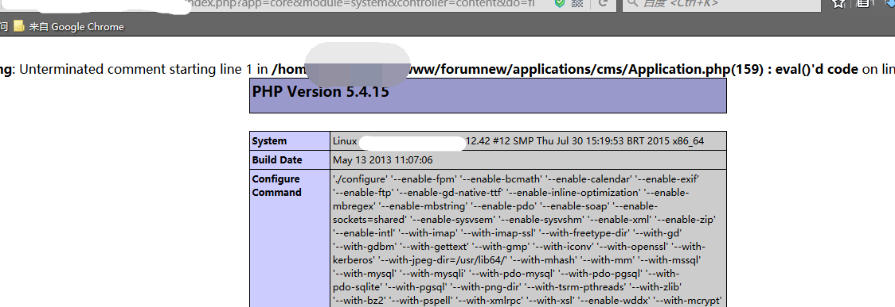
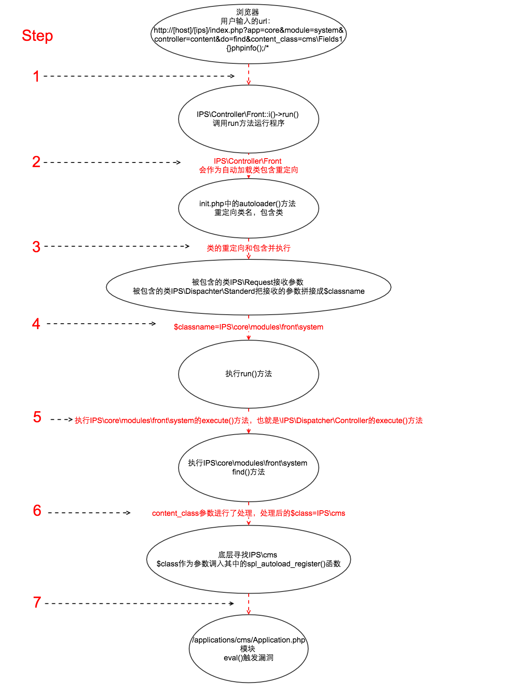
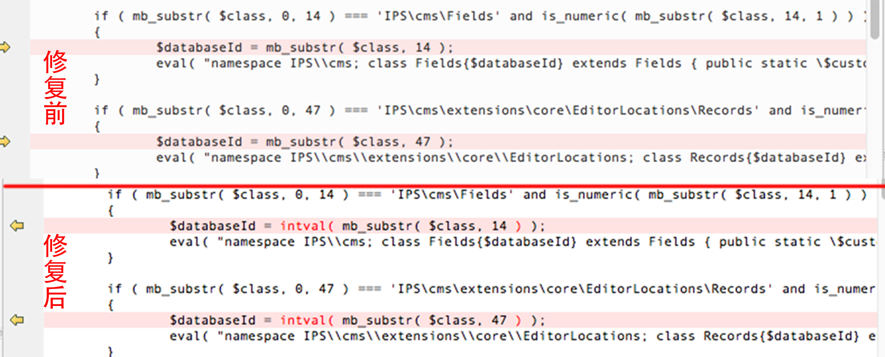

# IPS Community Suite 自动加载的PHP代码注入漏洞（CVE-2016-6174）

## 一、漏洞概述

### 1.漏洞信息
"IPS Community Suite "是一款国外比较常见的cms。但在其4.1.12.3版本及以下版本，存在PHP代码注入漏洞，该漏洞源于程序未能充分过滤content_class请求参数。远程攻击者可利用该漏洞注入并执行任意PHP代码。
### 2. 漏洞触发条件：
-------
IPS版本：<=4.1.12.3

php环境：<=5.4.24和5.5.0-5.5.8

### 3. 漏洞复现效果图：
-------



### 4. 漏洞原理图：
-------



### 5. 检测poc

`http://[host]/[ips]/index.php?app=core&module=system&controller=content&do=find&content_class=cms\Fields1{}phpinfo();/*`

## 二、漏洞分析

首先，在cms的入口`index.php`中的`IPS\Controller\Front::i()`
在调用run方法运行程序时:

`IPS\Controller\Front`

会作为自动加载类先被`init.php`中的`autoloader()`方法所重定向并包含。

在该过程中会首先包含`IPS\Request`(`/system/Request/Request.php`),参数在这里被接收：

```

 IPS\Request Object (
  [_url:protected] => IPS\Http\Url Object (
    [url:protected]
    => http://localhost/IPS/index.php?app=core&module=system&controller=content&do=find&content_class=cms\Fields1{}phpinfo();/*
    [data] => Array (
      [scheme] => http
      [host] => localhost
      [path] => /IPS/index.php
      [query] => app=core&module=system&controller=content&do=find&content_class=cms\Fields1{}phpinfo();/*
      )
      [queryString] => Array (
        [app] => core
        [module] => system
        [controller] => content
        [do] => find
        [content_class] => cms\Fields1{}phpinfo();/* )
        [isInternal] => 1
        [isFriendly] =>
      )
      [data:protected] => Array (
        [app] => core
        [module] => system
        [controller] => content
        [do] => find
        [content_class] => cms\Fields1{}phpinfo();/*
      )
  )
```

可以明显的看到url被`Request`对象中的`data`数组以键值得形式所接收并存储。

之后会包含`IPS\Dispatcher\Standard`，在这个类中，有以下定义：

```
$this->classname = 'IPS\\' . $this->application->directory . '\\modules\\' . $this->controllerLocation . '\\' . $this->module->key . '\\' . $this->controller;
```

会将之前接收的参数拼接成`$classname`(`$classname=IPS\core\modules\front\system`)。

包含执行完毕后在`IPS\Dispatcher`中调用方法`run()`方法：

``` php
public function run()
{
  /* Init class */
  if( !class_exists( $this->classname ) )
  {
    \IPS\Output::i()->error( 'page_doesnt_exist', '2S100/1', 404 );
  }
  $this->dispatcherController = new $this->classname;
  if( !( $this->dispatcherController instanceof \IPS\Dispatcher\Controller ) )
  {
    \IPS\Output::i()->error( 'page_not_found', '5S100/3', 500, '' );
  }

  /* Execute */
  $this->dispatcherController->execute();

  $this->finish();
}
```
可以看到现在的`$this->dispatcherController=IPS\core\modules\front\system`。
之后判断`IPS\core\modules\front\system`是否为`\IPS\Dispatcher\Controller`的子类。

在` /applications/core/modules/front/system/content.php`找到`IPS\core\modules\front\system`:

```
namespace IPS\core\modules\front\system;
class _content extends \IPS\Dispatcher\Controller
```
满足条件，之后便执行`execute()`方法。


在`/system/Dispatcher/Controller.php`中有：

```
call_user_func( array( $this, \IPS\Request::i()->do ) );
```

以上函数就是将`execute()`函数作为回调函数执行，而`execute()`函数在`/system/Dispatcher/Dispatcher.php`中的`i()`方法执行。`i()`方法将`Controller`作为一个静态类名；等同于现在将执行`IPS\Dispatcher\Controller`中的`find()`方法也就是执行`IPS\core\modules\front\system`中的`find()`方法：

``` php

$class = 'IPS\\' .implode('\\',explode('_'IPS\Request::i()->content_class ) );

if ( ! class_exists( $class ) or ! in_array( 'IPS\Content', class_parents( $class ) ) )
{
	\IPS\Output::i()->error( 'node_error', '2S226/2', 404, '' );
}
```

这里对我们传进来的`content_class`参数进行了处理，处理后的`$class`为`IPS\cms`，由于`class_exists()`函数本身的机制，导致它默认执行`__autoload`。

php在底层寻找`IPS\cms`（`/applications/cms/Application.php`），`$class`作为参数被调入其中的`spl_autoload_register()`函数。其中在：

```
if ( mb_substr( $class, 0, 14 ) === 'IPS\cms\Fields' and is_numeric( mb_substr( $class, 14, 1 ) ) )
{
  $databaseId = mb_substr( $class, 14 );
  eval( "namespace IPS\\cms; class Fields{$databaseId} extends Fields { public static \$customDatabaseId = $databaseId; }" );
}
```
这里将我们构造的poc的前14个字符截断，与`IPS\cms\Fields`进行比较，之后判断第15个字符是否为数字或字符串，满足条件后，再将截取前14个字符串之后的值作为`$databaseId`，也就是：

`$databaseId=1{}phpinfo();/*`

  将其带入到`eval()`函数中，造成我们构造的php代码执行。

## 三、官方修复分析

经过我们的分析对比

发现 ／applications/cms/Application.php这个文件中 原来的`spl_autoload_register()`和更新后




我们可以看到，官方利用`intval()`函数对最后传入的`$class`进行来整数验证

使得传入的`$class`的第14位后被限定成为一个整数，防止传入字符串进入`eval()`

>**而升级PHP版本带来的修复是**

在`PHP`的新版本`>=5.4.25`或者`>=5.5.9`里变更了`class_exists`的机制

而低于的版本则没有此限制可以正常触发漏洞
```
    $class = 'IPS' . implode( '', explode( '_', IPSRequest::i()->content_class ) );
    if ( ! class_exists( $class ) or ! in_array( 'IPSContent', class_parents( $class ) ) )
    {
        IPSOutput::i()->error( 'node_error', '2S226/2', 404, '' );
    }
```

此处

`$class="IPS\cms\Fields1{}phpinfo();/*"`的时候不再触发`class_exists()`去加载

`／applications/cms/Application.php`中的`spl_autoload_register()`故不再触发漏洞

## 四、漏洞修复

- 及时升级程序版本
- `PHP` `5.4.x`升级至`5.4.25`以上，`5.5.x`升级至`5.5.9`以上
- `IPS` 升级至`4.12.3.1`以上

## 五、参考
* https://www.seebug.org/vuldb/ssvid-92096
* https://invisionpower.com/
* http://windows.php.net/downloads/releases/archives/
* http://karmainsecurity.com/KIS-2016-11
* http://cve.mitre.org/cgi-bin/cvename.cgi?name=2016-6174
（该分析来自[Lucifaer](https://github.com/Lucifaer))
